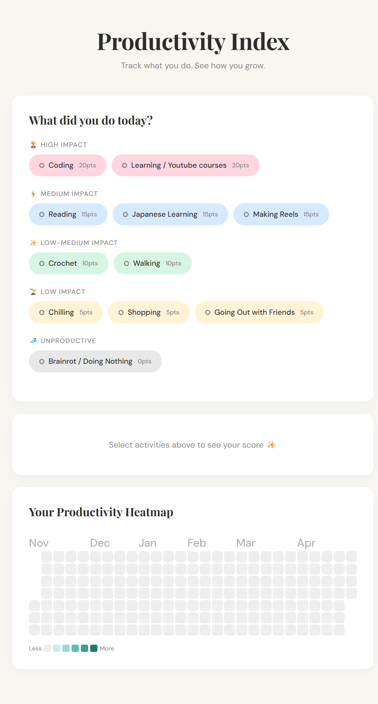

# 🌿 Productivity Index

🔗 **[Live Demo](https://productivity-index.vercel.app)**

A personal productivity tracker built with React + TypeScript. Log your daily activities, get a productivity score, and visualize your habits over time with a GitHub-style heatmap.

> Built as a portfolio project — because productivity is personal, and so is this app.



---

## ✨ Features

- **Activity logging** — pick from categorized activities grouped by impact level
- **Live scoring** — see your productivity score update in real time as you select activities
- **Day labels** — each day gets rated from *Unproductive* to *Super Productive* based on your score
- **Heatmap calendar** — visualize 6 months of productivity at a glance, GitHub-style
- **Persistent storage** — all data saved to `localStorage`, nothing lost on refresh
- **Duplicate guard** — can't accidentally save the same day twice

---

## 🗂 Tech Stack

- **React 18** with **TypeScript**
- **Vite** — fast dev server and build tool
- **react-calendar-heatmap** — heatmap visualization
- **localStorage** — client-side persistence, no backend needed
- Custom hook, utility functions, and clean component separation

---

## 🏗 Project Structure

```
src/
├── components/
│   ├── ActivitySelector.tsx   # Grouped pill-based activity picker
│   ├── DailyScore.tsx         # Live score + save functionality
│   ├── HeatmapCalendar.tsx    # 6-month productivity heatmap
│   └── DayLog.tsx             # (optional) past entries list
├── data/
│   └── activities.ts          # Activity definitions with points + categories
├── types/
│   └── index.ts               # TypeScript interfaces
├── utils/
│   └── scoring.ts             # calculateScore + getLabel pure functions
├── hooks/
│   └── useProductivity.ts     # State management + localStorage sync
└── App.tsx
```

---

## 🎯 Scoring System

Activities are weighted by impact:

| Category | Examples | Points |
|---|---|---|
| 🏆 High Impact | Coding, Learning / YouTube courses | 20 pts |
| ⚡ Medium Impact | Reading, Japanese, Making Reels | 15 pts |
| ✨ Low-Medium Impact | Crochet, Walking | 10 pts |
| 🌱 Low Impact | Chilling, Shopping, Going Out | 5 pts |
| 💤 Unproductive | Brainrot / Doing Nothing | 0 pts |

**Day Rating:**

| Score | Label |
|---|---|
| 0 – 10 | 😴 Unproductive |
| 11 – 30 | 🌤 Low Productivity |
| 31 – 55 | ⚡ Decent Day |
| 56 – 80 | 🔥 Productive Day |
| 81+ | 🚀 Super Productive |

---

## 🚀 Getting Started

```bash
# Clone the repo
git clone https://github.com/YOUR_USERNAME/productivity-index.git
cd productivity-index

# Install dependencies
npm install

# Start dev server
npm run dev
```

Open [http://localhost:5173](http://localhost:5173) in your browser.

---

## 🔑 Key Technical Decisions

**Why localStorage over a database?**
This is a personal, single-user app. localStorage keeps it simple, fast, and completely private — no auth, no backend, no cost.

**Why store activity IDs instead of full objects?**
Normalizing data avoids duplication. Activity metadata lives in one place (`data/activities.ts`), and `DayEntry` just references IDs. If a label changes, only one file needs updating.

**Why a custom hook over Context/Redux?**
The state is self-contained and used in one place (`App.tsx`). A custom hook is the right level of abstraction here — no overhead, easy to test, easy to extend.

---

## 🌱 Future Improvements

- [ ] Weekly and monthly summary stats
- [ ] Animated score counter on change
- [ ] Export data as CSV
- [ ] Dark mode toggle

---

## 👩‍💻 Author

Built by **Surbhi** — frontend developer with a love for clean UI and personal projects that actually get used.